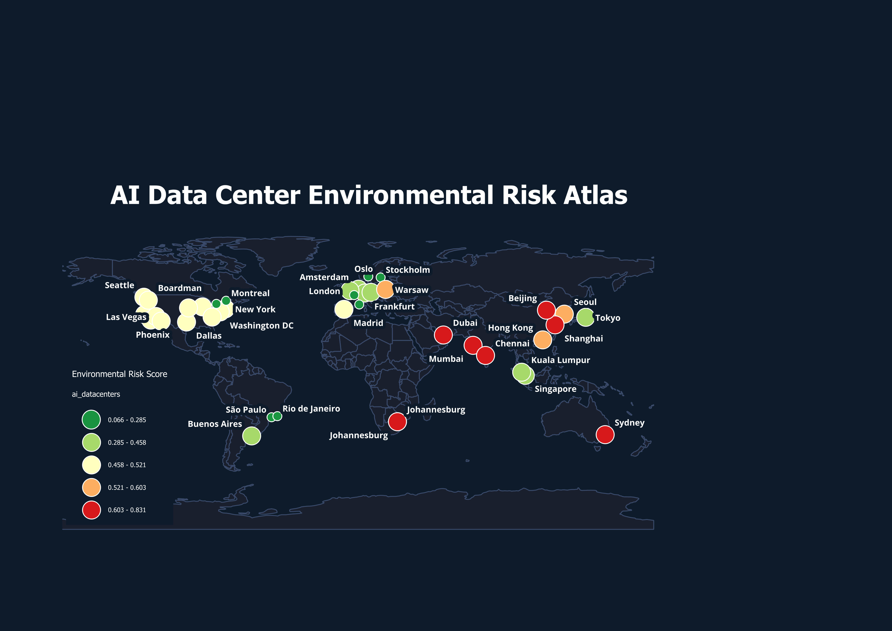

# AI Data Center Environmental Risk Atlas



A geospatial analysis and visualization of the **environmental footprint of global AI infrastructure**, built in [QGIS 3.34](https://qgis.org) with a custom Python-generated dataset. This project maps 40 major data centers worldwide against two critical environmental risk dimensions: **water stress** and **carbon intensity of the local energy grid**.

---

## What This Map Shows

Every dot on the map is a real AI/cloud data center. Two variables are encoded simultaneously:

- **Color** → Combined environmental risk score (green = low risk, red = high risk)
- **Size** → Facility capacity in megawatts (bigger dot = larger facility)

This allows instant visual pattern recognition:
- 🟡 **USA** — massive capacity but medium environmental risk
- 🟢 **Nordics (Norway, Sweden)** — small facilities powered by near-zero-carbon hydro/wind
- 🔴 **India & South Africa** — high water stress + coal-heavy grids = highest risk
- 🟠 **China & Southeast Asia** — large and growing, high carbon intensity

---

## Screenshots

### Full Atlas


---

## Dataset

Generated via `generate_datacenter_data.py` using publicly sourced environmental metrics.

### Data Centers (`ai_datacenters.geojson`)
40 real facilities across 22 countries, each with:

| Field | Description | Source |
|---|---|---|
| `name` | Facility name | Equinix, Switch, Google, Meta, AWS public records |
| `city` / `country` | Location | — |
| `lat` / `lon` | Coordinates | — |
| `tier` | Data center tier (1–4) | Uptime Institute classification |
| `mw` | Capacity in megawatts | Public facility disclosures |
| `water_stress` | Water stress index (0–5) | WRI Aqueduct Water Risk Atlas |
| `carbon_gco2_kwh` | Grid carbon intensity (gCO2/kWh) | Our World in Data / Ember 2023 |
| `risk_score` | Combined risk (0–1) | Calculated (see methodology) |

### Base Layers
- **Country boundaries** — Natural Earth 110m Admin 0 (v5.1.1)
- **Populated places** — Natural Earth 110m Populated Places Simple (v5.1.2)

---

## Reproducing This Visualization

### Requirements
- [QGIS 3.34](https://qgis.org/download/) (free, Windows/macOS/Linux)
- Python 3.x (for dataset generation only)

### Step 1 — Generate the dataset
```bash
python generate_datacenter_data.py
```
Outputs `ai_datacenters.geojson` and `ai_datacenters.csv`

### Step 2 — Download base layers
- [Natural Earth Countries](https://www.naturalearthdata.com/downloads/110m-cultural-vectors/) → Admin 0 Countries
- [Natural Earth Populated Places](https://www.naturalearthdata.com/downloads/110m-cultural-vectors/) → Populated Places Simple

### Step 3 — Load the QGIS project
1. Open QGIS
2. **Project → Open** → `ai_datacenter_risk_atlas.qgz`
3. Relink any missing layers to your local file paths
4. The full styled map loads automatically

### Step 4 — Export
**Project → Print Layout → Export as Image** at 300 DPI

---

## QGIS Pipeline

```
Layers (bottom to top):
├── ne_110m_admin_0_countries
│     Fill: #1a1f2e  |  Stroke: #3a4a6b 0.3px
│
├── ne_110m_populated_places_simple
│     Hidden (reference only)
│
└── ai_datacenters  [GeoJSON Point layer]
      Symbology: Graduated by risk_score (5 classes, RdYlGn inverted)
      Size: Proportional to mw field (range 3–12mm)
      Labels: city field, white bold 9pt, dark buffer
      Stroke: white 0.3px

Print Layout:
├── Map frame (full canvas)
├── Title: "AI Data Center Environmental Risk Atlas"
├── Subtitle: dot size = MW capacity, color = risk score
└── Legend: risk_score classes with color ramp
```

---

## Risk Score Methodology

The combined risk score is a weighted average of two normalized indicators:

```
risk_score = (water_stress / 5.0) × 0.5 + (carbon_gco2_kwh / 800.0) × 0.5
```

| Component | Weight | Rationale |
|---|---|---|
| Water stress (WRI Aqueduct, 0–5 scale) | 50% | AI cooling systems consume millions of gallons daily |
| Grid carbon intensity (gCO2/kWh) | 50% | Directly determines AI training/inference emissions |

Equal weighting reflects that both water and carbon are critical and non-substitutable environmental constraints on AI infrastructure.

---

## Key Findings

1. **The greenest major AI hubs are in Scandinavia** — Norway (26 gCO2/kWh) and Sweden (45 gCO2/kWh) have near-zero-carbon grids powered by hydroelectric and wind
2. **South Africa has the highest risk score** (0.83) — combining severe water scarcity with a coal-dominated grid (753 gCO2/kWh)
3. **US data centers are large but medium risk** — moderate water stress offset by a mixed energy grid
4. **India is rapidly expanding AI infrastructure** in high-risk conditions — Mumbai and Chennai both score above 0.7
5. **Singapore is a surprising bright spot** in Southeast Asia — lower risk than regional peers despite dense infrastructure

---

## Tools & Technologies

- **QGIS 3.34** — Layer styling, graduated symbology, print layout, map export
- **Python** — Dataset generation, risk score calculation
- **GeoJSON / Shapefile** — Vector geospatial data formats
- **Natural Earth** — Open cartographic base data
- **WRI Aqueduct** — Water risk index source
- **Our World in Data / Ember** — Carbon intensity source

---

## About

Created as a geospatial analysis work sample demonstrating proficiency in QGIS, spatial data visualization, and environmental risk analysis applied to AI infrastructure.
